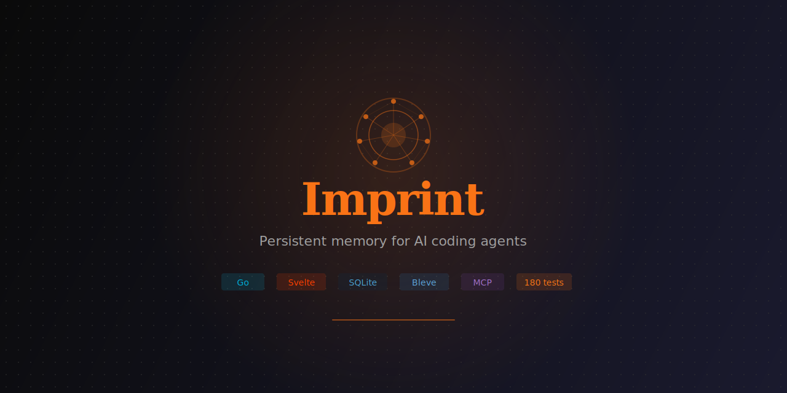
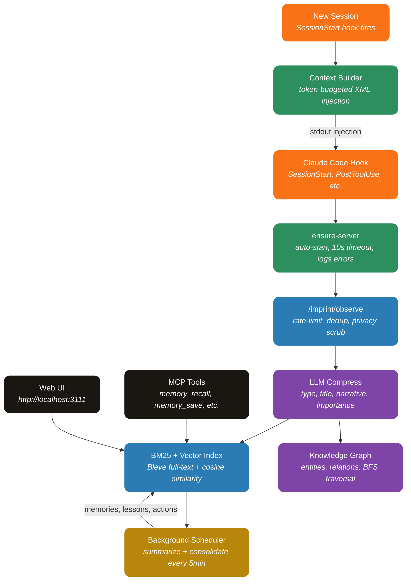

<div align="center">



**Persistent memory for AI coding agents — every session builds on the last.**

[](https://go.dev)
[](https://svelte.dev)
[](https://sqlite.org)
[](https://github.com/JohnPitter/imprint/actions)
[](#license)

[Features](#-features) · [How It Works](#-how-it-works) · [Install](#-install) · [Tech Stack](#-tech-stack) · [Development](#-development)

</div>

---

## What is Imprint?

Imprint is a **plugin for Claude Code** that gives your AI agent persistent memory across sessions. Every tool call, decision, and discovery is captured, compressed via LLM, indexed for search, and injected as context into future sessions.

**No Docker. No external databases. Single Go binary + SQLite.**

Inspired by [agentmemory](https://github.com/rohitg00/agentmemory) (Node.js + Docker) and [MemPalace](https://github.com/MemPalace/mempalace) (Python + ChromaDB), rebuilt from scratch in Go with ideas from both: agentmemory's observation pipeline and UI, MemPalace's 4-layer memory stack, query sanitization, and write-ahead log.

---

## Features

| Category | What you get |
|---|---|
| **Automatic Capture** | 11 hooks capture every tool use, prompt, error, and decision — zero manual effort |
| **LLM Compression** | Raw observations compressed into structured memories with concepts, files, and importance scores |
| **Background Pipeline** | Scheduler runs summarize + consolidate + action extraction every N minutes during active sessions (configurable) |
| **Hybrid Search** | BM25 (Bleve) + vector cosine similarity with Reciprocal Rank Fusion |
| **Knowledge Graph** | Entity extraction builds a graph of files, functions, concepts, and their relationships |
| **Context Injection** | Relevant memories injected at session start and before context compaction |
| **Smart Hooks** | User prompts captured as intent anchors, task completions sync to kanban, failures tracked for error learning |
| **Multi-Provider LLM** | Anthropic (API key + Claude Code OAuth auto-detect), OpenRouter, llama.cpp with circuit breaker + fallback |
| **MCP Server** | 8 tools for explicit memory recall, save, search, and graph queries |
| **11-Tab Web UI** | Dashboard, Sessions, Timeline, Memories, Graph, Actions, Lessons, Activity, Audit, Profile, Settings |
| **Global Topbar Search** | Modal search overlay on every page — query the Bleve index from anywhere with title, type, score, narrative, concepts and files |
| **Settings UI** | Select LLM provider/model, configure API keys, tune search weights, pipeline interval — all from the browser |
| **4-Layer Memory Stack** | L0 Identity, L1 Essential Story, L2 Session Context, L3 On-Demand Search — each with token budgets |
| **Actions Kanban** | Pending = waiting on user (permission prompts), In Progress = current prompt being worked on, Done = completed tasks. Older in-progress entries auto-graduate to done when a new one starts. |
| **Lessons & Insights** | Two-column split layout with independent scrolling — see lessons and insights side-by-side without scrolling the page |
| **Query Sanitizer** | Detects and strips system prompt contamination from search queries |
| **Write-Ahead Log** | Append-only JSONL audit of every write operation for crash recovery and poisoning detection |
| **Index Self-Heal** | If the BM25 index is empty on startup but the DB has compressed observations, a background goroutine reindexes everything automatically |
| **Transcript Mining** | `go run ./cmd/mine` imports historical Claude Code JSONL sessions retroactively |
| **Auto-Start** | Server launches automatically on first Claude Code session with retry + error logging |
| **Privacy** | All data stays local in `~/.imprint/`. Secrets are scrubbed with 16 regex patterns before storage |

---

## How It Works



### The Pipeline

1. **Capture** — 11 compiled Go hooks intercept Claude Code events (tool use, prompts, errors, task completions, permission prompts)
2. **Scrub** — 16 regex patterns strip API keys, tokens, JWTs, and secrets before storage
3. **Compress** — Background workers send raw observations to an LLM (Anthropic / OpenRouter / llama.cpp with circuit breaker + fallback), producing structured summaries with type, title, narrative, importance (1-10), concepts, and files
4. **Index** — Each compressed observation is immediately indexed into Bleve (BM25) inside the worker. On startup, an empty BM25 with rows in the DB triggers a self-heal reindex of every compressed observation
5. **Schedule** — Background scheduler runs summarize + consolidate + action extraction periodically during active sessions
6. **Extract** — LLM extracts entities (files, functions, concepts) and relations into a knowledge graph
7. **Inject** — On new sessions, token-budgeted context blocks are built from recent summaries, high-importance observations, and strong memories

### Hook Architecture

| Hook | Trigger | What it does |
|---|---|---|
| **session-start** | Claude Code opens | Creates session, injects context (retry 3x with backoff) |
| **prompt-submit** | User sends message | Captures user intent as high-importance observation; opens an `in_progress` entry on the Actions kanban (older in-progress in the same session graduate to done) |
| **pre-tool-use** | Before Read/Edit/Grep | Enriches context with relevant memories for the files being touched |
| **post-tool-use** | After any tool | Records observation, auto-compresses via LLM, indexes the result into BM25 |
| **post-tool-failure** | Tool fails | Records error with distinct type for pattern detection |
| **pre-compact** | Context compaction | Saves snapshot before context is lost, injects recovered context |
| **notification** | Permission prompt | Surfaces the prompt as a `pending` action so the user sees Claude is waiting on them |
| **subagent-start / subagent-stop** | Task agent spawned/finished | Records subagent lifecycle for the activity feed |
| **stop** | Session ends | Processes transcript for missed observations |
| **session-end** | Session finalizes | Runs finalize pipeline (graph, actions, reflect) |

---

## Install

### Prerequisites

- Go 1.25+
- Node.js 18+ (for frontend build)

### Option 1: Claude Code Plugin Marketplace

```bash
# Add the marketplace (one time)
/plugin marketplace add JohnPitter/imprint

# Install the plugin
/plugin install imprint@imprint-tools
```

Then build the binaries:
```bash
cd ~/.claude/plugins/cache/imprint-tools/imprint/1.0.0
go run ./cmd/install
```

### Option 2: Clone and Install

```bash
git clone https://github.com/JohnPitter/imprint.git
cd imprint
go run ./cmd/install
```

This builds all binaries (server, 11 hooks, ensure-server launcher, MCP server), registers hooks and MCP in Claude Code settings, and sets up auto-start.

### What Happens After Install

1. Open a new Claude Code session
2. The **SessionStart** hook auto-starts the Imprint server
3. Every tool use is captured automatically
4. Open **http://localhost:3111** to see the dashboard
5. MCP tools (`memory_recall`, `memory_save`, etc.) are available to Claude

### Uninstall

```bash
cd imprint
go run ./cmd/install --uninstall
```

---

## Tech Stack

| Layer | Technology |
|---|---|
| **Language** | Go 1.25 (pure Go, no CGO) |
| **Database** | SQLite with WAL mode (modernc.org/sqlite) |
| **Search** | Bleve (BM25 full-text) + in-memory vector (cosine similarity) |
| **HTTP** | Chi router + embedded Svelte SPA |
| **Frontend** | Svelte 3 + TypeScript + Vite |
| **LLM** | Anthropic, OpenRouter, llama.cpp (configurable fallback chain) |
| **Protocol** | MCP (JSON-RPC over stdio) |
| **Hooks** | 11 compiled Go binaries + ensure-server launcher (~6MB each, <50ms startup) |
| **Testing** | Go testing + httptest |
| **CI/CD** | GitHub Actions (lint, test, build, security) |

---

## Development

### Setup

```bash
git clone https://github.com/JohnPitter/imprint.git
cd imprint

# Install frontend deps
cd frontend && npm install && cd ..

# Run dev server
go run .

# Run tests
go test ./... -count=1

# Build production
cd frontend && npm run build && cd ..
go build -ldflags="-s -w" -o imprint.exe .

# Build hooks + MCP
go run ./cmd/install --build-only
```

### Structure

```
imprint/
  main.go                    # HTTP server + scheduler entrypoint
  internal/
    config/                  # Config loader + user settings
    store/                   # SQLite stores (17 stores, 28 tables)
    search/                  # BM25 + vector + hybrid search
    llm/                     # Provider interface + Anthropic/OpenRouter/llama.cpp
    pipeline/                # Compress, summarize, consolidate, graph extract
    privacy/                 # Secret scrubbing (16 regex patterns)
    service/                 # Business logic layer + scheduler
    server/                  # HTTP handlers + Chi router
    mcp/                     # MCP JSON-RPC server
    hooks/                   # Shared hook library
  cmd/
    hooks/                   # 11 hook binaries
    ensure-server/           # cross-platform auto-start launcher invoked by SessionStart
    mcp-server/              # Standalone MCP binary
    install/                 # One-command installer
  frontend/                  # Svelte 3 + TypeScript UI
  plugin/                    # Claude Code plugin structure
```

### Environment Variables

| Variable | Default | Description |
|---|---|---|
| `IMPRINT_PORT` | `3111` | HTTP server port |
| `IMPRINT_DATA_DIR` | `~/.imprint` | Data directory |
| `IMPRINT_SECRET` | — | Optional Bearer token for API auth |
| `ANTHROPIC_API_KEY` | auto-detect | API key or Claude Code OAuth |
| `OPENROUTER_API_KEY` | — | OpenRouter API key |
| `LLAMACPP_URL` | `http://localhost:8080` | llama.cpp server URL |
| `PIPELINE_INTERVAL_MIN` | `5` | Background pipeline interval (0 = disabled) |

---

## Privacy

- All data stored locally in `~/.imprint/`
- 16 regex patterns scrub API keys, tokens, JWTs, passwords before storage
- No telemetry, no tracking, no external calls (except configured LLM API)
- Open source for audit

---

## Acknowledgments

Imprint stands on the shoulders of two excellent projects:

- **[agentmemory](https://github.com/rohitg00/agentmemory)** by Rohit Ghumare — the original persistent memory system for AI coding agents. Imprint adopted its observation capture pipeline, hook architecture, LLM compression approach, and web dashboard concept.
- **[MemPalace](https://github.com/MemPalace/mempalace)** — a verbatim-first memory system with innovative ideas. Imprint adopted its 4-layer memory stack with token budgets, query sanitizer for system prompt contamination, write-ahead audit log, heuristic memory classification, and temporal knowledge graph invalidation.

---

## License

MIT License — use freely.
