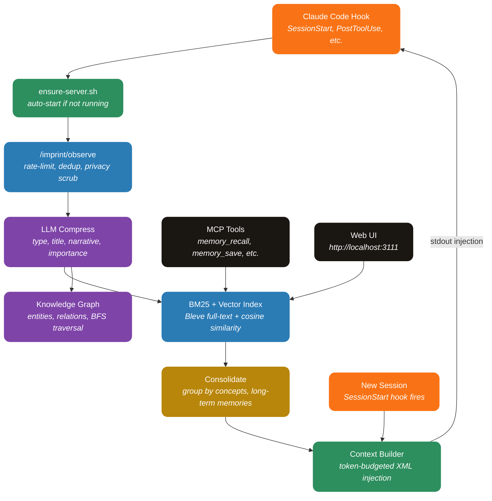

<div align="center">


**Persistent memory for AI coding agents — every session builds on the last.**

[](https://go.dev)
[](https://svelte.dev)
[](https://sqlite.org)
[](https://go.dev)
[](#license)

[Features](#-features) · [How It Works](#-how-it-works) · [Install](#-install) · [Tech Stack](#-tech-stack) · [Development](#-development)

</div>

---

## What is Imprint?

Imprint is a **plugin for Claude Code** that gives your AI agent persistent memory across sessions. Every tool call, decision, and discovery is captured, compressed via LLM, indexed for search, and injected as context into future sessions.

**No Docker. No external databases. Single Go binary + SQLite.**

---

## Features

| Category | What you get |
|---|---|
| **Automatic Capture** | 12 hooks capture every tool use, prompt, error, and decision — zero manual effort |
| **LLM Compression** | Raw observations compressed into structured memories with concepts, files, and importance scores |
| **Hybrid Search** | BM25 (Bleve) + vector cosine similarity with Reciprocal Rank Fusion |
| **Knowledge Graph** | Entity extraction builds a graph of files, functions, concepts, and their relationships |
| **Context Injection** | Relevant memories automatically injected at session start and before context compaction |
| **Multi-Provider LLM** | Anthropic (API key + Claude Code OAuth auto-detect), OpenRouter, llama.cpp with circuit breaker + fallback |
| **MCP Server** | 8 tools for explicit memory recall, save, search, and graph queries |
| **12-Tab Web UI** | Dashboard, Sessions, Timeline, Memories, Graph, Actions, Crystals, Lessons, Activity, Audit, Profile, Settings |
| **Settings UI** | Select LLM provider/model, configure API keys, tune search weights — all from the browser |
| **Auto-Start** | Server launches automatically on first Claude Code session |
| **180 Tests** | Unit + integration tests across all layers |
| **Privacy** | All data stays local in `~/.imprint/`. Secrets are scrubbed with 16 regex patterns before storage |

---

## How It Works



### The Pipeline

1. **Capture** — 12 compiled Go hooks intercept Claude Code events (tool use, prompts, errors)
2. **Scrub** — 16 regex patterns strip API keys, tokens, JWTs, and secrets before storage
3. **Compress** — Background workers send raw observations to LLM, producing structured summaries with type, importance (1-10), concepts, and files
4. **Index** — Compressed observations indexed in Bleve (BM25) and in-memory vector store
5. **Extract** — LLM extracts entities (files, functions, concepts) and relations into a knowledge graph
6. **Inject** — On new sessions, token-budgeted context blocks are built from recent summaries, high-importance observations, and strong memories

---

## Install

### Prerequisites

- Go 1.25+
- Node.js 18+ (for frontend build)

### One-Command Install

```bash
git clone https://github.com/JohnPitter/imprint.git
cd imprint
go run ./cmd/install
```

This builds all binaries, registers hooks and MCP server in Claude Code settings, and sets up auto-start.

### Uninstall

```bash
go run ./cmd/install --uninstall
```

---

## Tech Stack

| Layer | Technology |
|---|---|
| **Language** | Go 1.25 (pure Go, no CGO) |
| **Database** | SQLite with WAL mode (modernc.org/sqlite) |
| **Search** | Bleve (BM25 full-text) + in-memory vector (cosine similarity) |
| **HTTP** | Chi router + embedded Svelte SPA |
| **Frontend** | Svelte 3 + TypeScript + Vite |
| **LLM** | Anthropic, OpenRouter, llama.cpp (configurable fallback chain) |
| **Protocol** | MCP (JSON-RPC over stdio) |
| **Hooks** | 12 compiled Go binaries (~6MB each, <50ms startup) |
| **Testing** | Go testing + httptest (180 tests) |
| **CI/CD** | GitHub Actions (lint, test, build, security) |

---

## Development

### Setup

```bash
git clone https://github.com/JohnPitter/imprint.git
cd imprint

# Install frontend deps
cd frontend && npm install && cd ..

# Run dev server
go run .

# Run tests
go test ./... -count=1

# Build production
cd frontend && npm run build && cd ..
go build -ldflags="-s -w" -o imprint.exe .

# Build hooks + MCP
go run ./cmd/install --build-only
```

### Structure

```
imprint/
  main.go                    # HTTP server entrypoint
  internal/
    config/                  # Config loader + user settings
    store/                   # SQLite stores (17 stores, 28 tables)
    search/                  # BM25 + vector + hybrid search
    llm/                     # Provider interface + Anthropic/OpenRouter/llama.cpp
    pipeline/                # Compress, summarize, consolidate, graph extract
    privacy/                 # Secret scrubbing (16 regex patterns)
    service/                 # Business logic layer
    server/                  # HTTP handlers + Chi router
    mcp/                     # MCP JSON-RPC server
    hooks/                   # Shared hook library
  cmd/
    hooks/                   # 12 hook binaries
    mcp-server/              # Standalone MCP binary
    install/                 # One-command installer
  frontend/                  # Svelte 3 + TypeScript UI
  plugin/                    # Claude Code plugin structure
```

### Environment Variables

| Variable | Default | Description |
|---|---|---|
| `IMPRINT_PORT` | `3111` | HTTP server port |
| `IMPRINT_DATA_DIR` | `~/.imprint` | Data directory |
| `ANTHROPIC_API_KEY` | auto-detect | API key or Claude Code OAuth |
| `OPENROUTER_API_KEY` | — | OpenRouter API key |
| `LLAMACPP_URL` | `http://localhost:8080` | llama.cpp server URL |

---

## Privacy

- All data stored locally in `~/.imprint/`
- 16 regex patterns scrub API keys, tokens, JWTs, passwords before storage
- No telemetry, no tracking, no external calls (except configured LLM API)
- Open source for audit

---

## License

MIT License — use freely.
