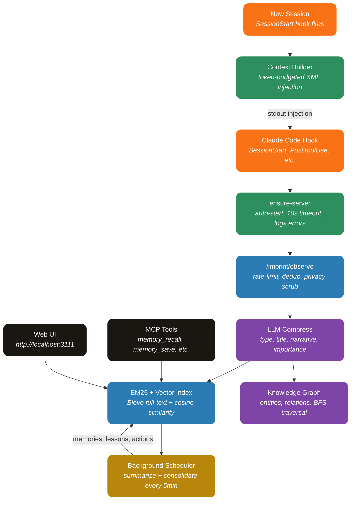

<div align="center">


**Persistent memory for AI coding agents — every session builds on the last.**

[](https://go.dev)
[](https://svelte.dev)
[](https://sqlite.org)
[](https://github.com/JohnPitter/imprint/actions)
[](#license)

[Features](#features) · [How It Works](#how-it-works) · [Install](#install) · [Architecture](docs/ARCHITECTURE.md) · [Changelog](CHANGELOG.md) · [Development](#development)

</div>

---

## What is Imprint?

Imprint is a **plugin for Claude Code and Codex** that gives your AI agent persistent memory across sessions. Every tool call, decision, and discovery is captured, compressed via a cheap LLM, indexed for search, and injected as context into future sessions.

Since **v2.0** it is also a **token-economy + high-value-memory** plugin: it measures the token *saldo* (context saved − background LLM spent), organizes memory into **three explicit layers** (base → refined → rooted "intuitions"), injects lazily, and runs the background work on a cheap model — **Haiku** on Claude Code, **GPT-5 mini/nano** on Codex.

**No Docker. No external databases. Single Go binary + SQLite.**

> Works the same on both agents. On Claude Code it auto-detects the Claude OAuth token (Haiku); on Codex it reuses your `codex login` (ChatGPT OAuth) or an `OPENAI_API_KEY` (GPT-5). When an Anthropic key is present it takes priority; the providers are a fallback chain, so both can coexist in one install.

Inspired by [agentmemory](https://github.com/rohitg00/agentmemory) (Node.js + Docker) and [MemPalace](https://github.com/MemPalace/mempalace) (Python + ChromaDB), rebuilt from scratch in Go with ideas from both: agentmemory's observation pipeline and UI, MemPalace's 4-layer memory stack, query sanitization, and write-ahead log.

---

## Features

| Category | What you get |
|---|---|
| **Token Economy Meter** *(v2.0)* | Append-only `token_ledger` + `injection_log` track every background-LLM spend and every injected memory. `GET /imprint/economy` and the **Economy** tab show the *saldo* (context saved − LLM spent) per repo, plan-aware: currency for API plans, "fôlego" (breathing room) for subscriptions. "Memory used" is measured cheaply via file/concept co-occurrence. |
| **Budget Ceiling** *(v2.0)* | A spend ceiling (per session/day) that protects *before* overspending: when hit, background compression pauses and injection falls to the minimum — the main path never breaks. Configurable in Settings. |
| **Three Memory Layers + Intuition** *(v2.0)* | Explicit layers: **base** (compressed observations) → **refined** (memories) → **rooted** (*intuitions* — cross-cutting "how to reason" premises). Intuitions are born only by convergence of many insights, injected resident at max priority, and **auto-weaken on contradiction**. The **Intuitions** tab is an always-on inspection screen (evidence, force, contradiction log, manual demote/delete). |
| **Lazy Injection** *(v2.0)* | Instead of dumping everything at session start, pull refined memory **on demand** when a turn touches a file/concept (`POST /imprint/inject/lazy`) — memory the turn doesn't need is memory not spent. |
| **Importance Gate** *(v2.0)* | Before compression, a cheap score decides if an observation can become a refined memory; trivial ones are captured deterministically into the base layer with **zero** LLM spend. |
| **Code-Graph Relevance** *(v2.0)* | Editing a file pulls in memories about its graph **blast radius** (structurally related files), boosting lazy injection. Pure-Go over the existing graph (no tree-sitter / CGO). |
| **Memory Governance (A5)** *(v2.0)* | Export, purge-by-repo, and full reset of your own memory — deletes from the search indexes too ("apagar é apagar"). |
| **Codex + Cheap GPT-5** *(v2.0)* | Full feature parity on Codex. Background work runs on **gpt-5-mini** (or `gpt-5-nano`, cheapest) — the Codex equivalent of Haiku — via your `codex login` (ChatGPT OAuth, no API key) or `OPENAI_API_KEY`. Auto-detected, zero-config. |
| **Automatic Capture** | 11 hooks capture every tool use, prompt, error, and decision — zero manual effort |
| **LLM Compression** | Raw observations compressed into structured memories with concepts, files, and importance scores |
| **Hybrid Extraction** *(v1.2.0)* | Regex pre-pass extracts files, PascalCase concepts, URLs, error markers, and git refs deterministically. The LLM only writes title/narrative/importance — fewer tokens, faster, half the Haiku spend. Toggle with `IMPRINT_EXTRACTION_MODE=llm-only` to revert. |
| **Prompt-Injection Defense** *(v1.3.0)* | Tool outputs are scrubbed for ~12 known injection patterns ("ignore previous instructions", role-hijack, system-tag spoofs, exfil prompts, fence breakouts) before storage. Suspicious spans become `[FLAGGED:reason]` markers in the audit log. |
| **Memory Decay** *(v1.3.0)* | Low-strength memories (≤3) older than 30 days are soft-archived every 6 hours so retrieval stays focused on signal. Strong memories survive forever. |
| **Backlink-Boosted Ranking** *(v1.3.0)* | Optional graph in-degree multiplier on hybrid search. A memory referenced by N other nodes ranks higher; activates once a graph provider is attached. |
| **Eval Capture** *(v1.3.0, opt-in)* | With `IMPRINT_EVAL_CAPTURE=1`, every search/recall captures (query, returned ids) into an `eval_candidates` table after PII scrubbing. Export via `GET /imprint/eval/export` (NDJSON). Replay tooling lands in a follow-up. |
| **Live Actions Kanban** *(v1.4.0)* | The Actions tab now streams updates via Server-Sent Events on `GET /imprint/actions/stream`. Cards animate between Pending/In Progress/Done columns the moment the agent moves them, no 5-second poll wait. Each card carries a session badge so you can tell which Claude Code session produced it. Polling stays as a fallback when SSE is unavailable. |
| **Pinned Memories** *(v1.5.0)* | Toggle the ★ in any memory card or the modal header to immunize it against the decay sweep. Critical decisions and architecture notes survive forever even when rarely reinforced. |
| **Time-Travel Slider** *(v1.5.0)* | Drag the slider on the Memories tab to ask "what did I know N days ago?" — backend filters by `created_at <= cutoff`. Refresh-resistant: state survives in `?days=N`. |
| **Inline Concept Editor** *(v1.5.0)* | Click any concept pill in the Memory modal to remove, or use the "+" input to add. Persists immediately via `POST /memories/concepts`. |
| **Why-This-Memory Score Breakdown** *(v1.5.0)* | Hit "Why was this retrieved?" inside any Memory modal — runs a hybrid search by the title and shows the BM25/Vec/Rank scores for the top 5 results. Debugging the retrieval is no longer a black box. |
| **Cluster Summarizer** *(v1.5.0)* | Hover a node in the Graph for ~600ms; the LLM names the cluster topic in 4-7 words ("Spring Boot · transaction expiration"). In-memory cache means the same hover doesn't burn Haiku tokens twice. |
| **Conversation Playback** *(v1.5.0)* | Click "Playback" in any session card to open a unified chronological timeline of observations + memories created + actions, with rail-style visualization. Useful for retro reviews. |
| **Pipeline Health Dashboard** *(v1.5.0)* | Header badge shows HEALTHY / BACKLOG / IDLE / STALLED derived from real-time pipeline state. Sparkline of LLM calls/minute (last 30 datapoints) + auto-detect of circuit breakers + 8s polling so you can see throughput live. |
| **Live Knowledge Graph** *(v1.5.0+)* | Force-directed memory graph with light/dark theme, percentile-based fit-to-bounds (no more outliers shrinking your cluster), zoom controls, label-propagation community detection (colored halos = topology clusters), idle breath animation, hover ripples, and synaptic pulses streaming along edges like a live neural net. |
| **Memory Decay (Configurable)** *(v1.5.0)* | Settings UI exposes `min_strength_to_archive` and `min_age_days` sliders; the scheduler reads from the live config so changes apply without restart. Pinned memories always exempt. |
| **Color-Coded Concepts** *(v1.5.0)* | Concept tags use a deterministic hash → fixed palette so the same concept ("auth", "decay") always paints the same color across Memories, Lessons, and Graph tooltips. Click any tag in Lessons to filter. |
| **Knowledge Graph Pipeline** | LLM extracts entities (files, functions, concepts) and relations from compressed observations. *(v1.5.0)* now runs incrementally on the periodic scheduler — `graph_extracted_at` column dedups so existing rows aren't re-processed every tick. |
| **Background Pipeline** | Scheduler runs summarize + consolidate + action extraction + graph extract every N minutes during active sessions (configurable) |
| **Heartbeat-Based Finalize** *(v1.5.4)* | The Claude Code `SessionEnd` event doesn't fire reliably on `/exit`, so finalize is triggered by **absence** of activity instead. The `Stop` hook posts `/imprint/session/heartbeat` every turn; after 15min without one, the scheduler runs `RunFinalize` (final summarize + consolidate + graph + actions + reflect) and marks the session completed. Sessions that get finalized but receive a heartbeat later (long pause + return) are auto-resurrected back to `active`, preserving the audit trail. |
| **Hybrid Search** | BM25 (Bleve) + vector cosine similarity with Reciprocal Rank Fusion. Search responses now include per-result `bm25Score` / `vecScore` / `rank` *(v1.5.0)*. |
| **Context Injection** | Relevant memories injected at session start and before context compaction. *(v1.5.0)* injected items now carry inline metadata sufixes — `(★N · Xd)` on memories, `(iN · Xd)` on observations — so the assistant sees strength and age without a DB query. |
| **Smart Hooks** | User prompts captured as intent anchors, task completions sync to kanban, failures tracked for error learning. *(v1.5.0)* heuristic filter prevents short user prompts ("continua", "ok", task-notification XML) from polluting the Actions kanban. |
| **Multi-Provider LLM** | Anthropic (API key + Claude Code OAuth auto-detect), **OpenAI GPT-5** (API key), **Codex ChatGPT-OAuth** (reuses `codex login`), OpenRouter, llama.cpp — fallback chain with circuit breaker + token budget gate |
| **MCP Server** | 8 tools for explicit memory recall, save, search, and graph queries |
| **14-Tab Web UI** | Dashboard, **Economy**, Recall, Sessions, Timeline, Memories, **Intuitions**, Graph, Actions, Lessons, Activity, Audit, Profile, Settings |
| **Global Topbar Search** | Modal search overlay on every page — query the Bleve index from anywhere with title, type, score, narrative, concepts and files. *(v1.5.0)* keyboard shortcut: press `/` from anywhere to focus. |
| **URL-Synced UI State** *(v1.5.0)* | Memories slider and Lessons tag filters reflect in the query string (`?days=7&tags=auth,decay`). Refresh-resistant + shareable links. |
| **Settings UI** | Select LLM provider/model, configure API keys, tune search weights, pipeline interval, decay thresholds — all from the browser |
| **4-Layer Memory Stack** | L0 Identity, L1 Essential Story, L2 Session Context, L3 On-Demand Search — each with token budgets |
| **Actions Kanban** | Pending = waiting on user (permission prompts), In Progress = current prompt being worked on, Done = completed tasks. Older in-progress entries auto-graduate to done when a new one starts. |
| **Lessons & Insights** | Two-column split layout with independent scrolling — see lessons and insights side-by-side without scrolling the page |
| **Query Sanitizer** | Detects and strips system prompt contamination from search queries |
| **Write-Ahead Log** | Append-only JSONL audit of every write operation for crash recovery and poisoning detection |
| **Index Self-Heal** | If the BM25 index is empty on startup but the DB has compressed observations, a background goroutine reindexes everything automatically |
| **Build Provenance** *(v1.5.1)* | `/imprint/health` exposes `version` + git `commit` injected via build-time ldflags. Dashboard System Health shows which binary is actually running. |
| **Transcript Mining** | `go run ./cmd/mine` imports historical Claude Code JSONL sessions retroactively |
| **Auto-Start** | Server launches automatically on first Claude Code session with retry + error logging |
| **Privacy** | All data stays local in `~/.imprint/`. Secrets are scrubbed with 16 regex patterns before storage |

---

## How It Works



### The Pipeline

1. **Capture** — 11 compiled Go hooks intercept Claude Code events (tool use, prompts, errors, task completions, permission prompts)
2. **Scrub** — 16 regex patterns strip API keys, tokens, JWTs, and secrets before storage
3. **Pre-extract** *(v1.2.0)* — A deterministic regex pass pulls file paths, PascalCase concepts, URLs, error markers, and git refs out of the observation. The LLM never has to re-extract the easy mechanical entities, cutting Haiku spend.
4. **Compress** — Background workers send the remaining work to an LLM (Anthropic / OpenRouter / llama.cpp with circuit breaker + fallback), producing structured summaries with type, title, narrative, importance (1-10), concepts (merged with the pre-pass), and files (already extracted)
5. **Index** — Each compressed observation is immediately indexed into Bleve (BM25) inside the worker. On startup, an empty BM25 with rows in the DB triggers a self-heal reindex of every compressed observation
6. **Schedule** — Background scheduler runs summarize + consolidate + action extraction + **graph extract** periodically during active sessions. Graph extract is incremental (`v1.5.0`): only obs without `graph_extracted_at` are processed, capped per tick to control Haiku cost.
7. **Extract** — LLM extracts entities (files, functions, concepts) and relations into a knowledge graph
8. **Inject** — On new sessions, token-budgeted context blocks are built from recent summaries, high-importance observations, and strong memories. Each item carries an inline metadata sufix (`★N · Xd` or `iN · Xd`) so the assistant has strength + age signal without a roundtrip to the DB.

### Hook Architecture

| Hook | Trigger | What it does |
|---|---|---|
| **session-start** | Claude Code opens | Creates session, injects context (retry 3x with backoff) |
| **prompt-submit** | User sends message | Captures user intent as high-importance observation; opens an `in_progress` entry on the Actions kanban (older in-progress in the same session graduate to done) |
| **pre-tool-use** | Before Read/Edit/Grep | Enriches context with relevant memories for the files being touched |
| **post-tool-use** | After any tool | Records observation, auto-compresses via LLM, indexes the result into BM25 |
| **post-tool-failure** | Tool fails | Records error with distinct type for pattern detection |
| **pre-compact** | Context compaction | Saves snapshot before context is lost, injects recovered context |
| **notification** | Permission prompt | Surfaces the prompt as a `pending` action so the user sees Claude is waiting on them |
| **subagent-start / subagent-stop** | Task agent spawned/finished | Records subagent lifecycle for the activity feed |
| **stop** | End of every assistant turn | Closes the kanban turn, processes transcript for missed observations, **posts `/imprint/session/heartbeat`** to keep the session alive *(v1.5.4)*. |
| **session-end** | Session finalizes | Best-effort fast-path: posts `/imprint/session/end` + `/imprint/finalize`. The Claude Code event doesn't fire reliably on `/exit`, so the canonical finalize path is the scheduler's heartbeat-idle sweep *(v1.5.4)* — see "Heartbeat-Based Finalize" above. |

---

## Install

### Option 1: Claude Code Plugin Marketplace (recommended)

```bash
# Add the marketplace (one time)
/plugin marketplace add JohnPitter/imprint

# Install the plugin
/plugin install imprint@imprint-tools
```

Restart Claude Code once. The **SessionStart** hook downloads the prebuilt
binaries for your platform (`darwin-arm64`, `darwin-amd64`, `linux-amd64`,
`linux-arm64`, `windows-amd64`) from the matching GitHub release on first
run. Subsequent sessions reuse the cached binaries (~ms).

No Go or Node toolchain required. Releases are signed with sha256 checksums
([latest](https://github.com/JohnPitter/imprint/releases/latest)).

### Option 2: Build from source

For development, plugin authoring, or unsupported platforms:

```bash
git clone https://github.com/JohnPitter/imprint.git
cd imprint
go run ./cmd/install            # build all binaries into plugin/bin/
```

Add the local plugin directly:

```bash
claude --plugin-dir $(pwd)/plugin
```

### Option 3: Codex Plugin

This repository also ships a Codex plugin manifest in
`plugin/.codex-plugin/plugin.json`. For local Codex discovery, use the repo
marketplace at `.agents/plugins/marketplace.json`, which points to `./plugin`.

On Windows, the Codex MCP entry uses `plugin/.mcp.codex.json` and starts:

```text
plugin/scripts/imprint-mcp.cmd
```

That wrapper builds `plugin/bin` from source if needed, starts the local Imprint
server, starts the `codex-watch` transcript watcher for backfill capture, then
launches the MCP stdio bridge. On macOS/Linux, use
`plugin/.mcp.codex.unix.json` or point Codex directly at:

```bash
bash plugin/scripts/imprint-mcp.sh
```

Codex support captures local sessions through official hooks declared in
`plugin/hooks/codex-hooks.json`: session start, prompt submit, pre/post tool
use, and stop events are stored as Imprint observations with `codex_` session
ids. The transcript watcher still tails `~/.codex/sessions/**/*.jsonl` as a
backfill path and keeps offsets in `~/.imprint/codex-watch-state.json` so
restarts do not replay old transcript lines.

**Background model (cheap GPT-5).** On Codex the heavy background work
(compress / consolidate / summarize / graph / intuition) runs on a cheap model —
the Codex equivalent of Haiku — with zero config:

- **ChatGPT OAuth** — if you ran `codex login` with a ChatGPT plan, Imprint
  reuses those tokens from `~/.codex/auth.json` directly (no API key): it
  refreshes the access token and calls the same ChatGPT-backend Responses API
  Codex uses. Model via `OPENAI_OAUTH_MODEL` (default `gpt-5`).
- **API key** — set `OPENAI_API_KEY` (or use an api-key `~/.codex/auth.json`).
  Defaults to `gpt-5-mini`; set `OPENAI_MODEL=gpt-5-nano` for the cheapest tier.

The provider chain is `anthropic → codex-oauth → openai → openrouter → llamacpp`
and each entry self-activates only when its credential exists, so Codex and
Claude Code coexist cleanly. See `plugin/README-CODEX.md` for details.

#### Legacy direct install

If you prefer the pre-marketplace flow that writes hooks/MCP straight into
`~/.claude/settings.json` (no marketplace required), pass `--register`:

```bash
go run ./cmd/install --register
```

This is kept for backwards compatibility. New users should use Option 1.

### What Happens After Install

1. Open a new Claude Code session
2. The **SessionStart** hook auto-starts the Imprint server
3. Every tool use is captured automatically
4. Open **http://localhost:3111** to see the dashboard
5. MCP tools (`memory_recall`, `memory_save`, etc.) are available to Claude

### Uninstall

```bash
cd imprint
go run ./cmd/install --uninstall
```

---

## Tech Stack

| Layer | Technology |
|---|---|
| **Language** | Go 1.25 (pure Go, no CGO) |
| **Database** | SQLite with WAL mode (modernc.org/sqlite) |
| **Search** | Bleve (BM25 full-text) + in-memory vector (cosine similarity) |
| **HTTP** | Chi router + embedded Svelte SPA |
| **Frontend** | Svelte 5 (runes) + TypeScript + Vite |
| **LLM** | Anthropic (Haiku), OpenAI GPT-5 (mini/nano), Codex ChatGPT-OAuth, OpenRouter, llama.cpp — configurable fallback chain |
| **Protocol** | MCP (JSON-RPC over stdio) |
| **Hooks** | 11 compiled Go hook binaries + ensure-server launcher; Codex adds `codex-hook` + `codex-watch` (~6MB each, <50ms startup) |
| **Testing** | Go testing + httptest |
| **CI/CD** | GitHub Actions (lint, test, build, security) |

---

## Development

### Setup

```bash
git clone https://github.com/JohnPitter/imprint.git
cd imprint

# Install frontend deps
cd frontend && npm install && cd ..

# Run dev server
go run .

# Run tests
go test ./... -count=1

# Build production
cd frontend && npm run build && cd ..
go build -ldflags="-s -w" -o imprint.exe .

# Build hooks + MCP
go run ./cmd/install --build-only
```

### Structure

```
imprint/
  main.go                    # HTTP server + scheduler entrypoint
  internal/
    config/                  # Config loader + user settings (+ Codex/OpenAI auth detect)
    store/                   # SQLite stores (20 stores, 32 tables; migrations 001-007)
    search/                  # BM25 + vector + hybrid search
    llm/                     # Providers: Anthropic, OpenAI GPT-5, Codex OAuth, OpenRouter, llama.cpp + budget gate
    pipeline/                # Compress (+ importance gate), summarize, consolidate, graph/intuition extract
    privacy/                 # Secret scrubbing (16 regex patterns)
    service/                 # Business logic + scheduler + intuition + memory admin (A5)
    server/                  # HTTP handlers + Chi router (economy, intuitions, lazy inject, governance)
    mcp/                     # MCP JSON-RPC server
    hooks/                   # Shared hook library
  cmd/
    hooks/                   # 11 hook binaries
    ensure-server/           # cross-platform auto-start launcher invoked by SessionStart
    mcp-server/              # Standalone MCP binary
    codex-hook/              # Codex hook adapter (Responses-aware)
    codex-watch/             # Codex transcript watcher (~/.codex/sessions backfill)
    install/                 # One-command installer
  frontend/                  # Svelte 5 + TypeScript UI
  plugin/                    # Claude Code + Codex plugin structure
```

### Environment Variables

| Variable | Default | Description |
|---|---|---|
| `IMPRINT_PORT` | `3111` | HTTP server port |
| `IMPRINT_DATA_DIR` | `~/.imprint` | Data directory |
| `IMPRINT_SECRET` | — | Optional Bearer token for API auth |
| `ANTHROPIC_API_KEY` | auto-detect | API key or Claude Code OAuth |
| `OPENAI_API_KEY` | auto-detect | OpenAI key, or api-key `~/.codex/auth.json` *(v2.0)* |
| `OPENAI_MODEL` | `gpt-5-mini` | OpenAI model for the API-key path; `gpt-5-nano` = cheapest *(v2.0)* |
| `OPENAI_OAUTH_MODEL` | `gpt-5` | Model for the Codex ChatGPT-OAuth path *(v2.0)* |
| `OPENAI_REASONING_EFFORT` | `minimal` | GPT-5 reasoning effort (`minimal`/`low`/`medium`/`high`) *(v2.0)* |
| `LLM_PROVIDER_ORDER` | `anthropic,codex-oauth,openai,openrouter,llamacpp` | Fallback chain order *(v2.0)* |
| `OPENROUTER_API_KEY` | — | OpenRouter API key |
| `LLAMACPP_URL` | `http://localhost:8080` | llama.cpp server URL |
| `IMPRINT_PLAN` | auto-detect | `api` / `pro` / `max` — drives the economy display *(v2.0)* |
| `IMPRINT_MAX_HAIKU_TOKENS_SESSION` | `500000` | Background token ceiling per session (0 = unlimited) *(v2.0)* |
| `IMPRINT_MAX_HAIKU_TOKENS_DAY` | `3000000` | Background token ceiling per day (0 = unlimited) *(v2.0)* |
| `IMPRINT_MAX_INJECTION_TOKENS` | `0` | Hard cap on injected tokens (0 = use layer budgets) *(v2.0)* |
| `COMPRESS_FILTER` | `true` | Skip the LLM for trivial observations (importance gate) *(v2.0)* |
| `COMPRESS_MIN_IMPORTANCE` | `4` | Score below which compression stays deterministic *(v2.0)* |
| `LAZY_INJECT_MAX` | `5` | Max refined memories pulled per lazy injection *(v2.0)* |
| `BLAST_RADIUS_DEPTH` | `2` | Graph hops for the relevance boost (0 = off) *(v2.0)* |
| `INTUITION_MAX_ACTIVE` | `5` | Hard residency cap for rooted intuitions per repo *(v2.0)* |
| `PIPELINE_INTERVAL_MIN` | `5` | Background pipeline interval (0 = disabled) |
| `DECAY_MIN_STRENGTH` | `3` | Memories with strength ≤ this become decay candidates *(v1.5.0)* |
| `DECAY_MAX_AGE_DAYS` | `30` | Min age before a weak memory is archived *(v1.5.0)* |
| `IMPRINT_EVAL_CAPTURE` | `0` | Set `1` to capture (query, returned ids) for retrieval regression testing |
| `IMPRINT_EXTRACTION_MODE` | `hybrid` | `hybrid` (regex pre-pass + LLM) or `llm-only` (legacy) |

---

## Privacy

- All data stored locally in `~/.imprint/`
- 16 regex patterns scrub API keys, tokens, JWTs, passwords before storage
- No telemetry, no tracking, no external calls (except configured LLM API)
- Open source for audit

---

## Acknowledgments

Imprint stands on the shoulders of two excellent projects:

- **[agentmemory](https://github.com/rohitg00/agentmemory)** by Rohit Ghumare — the original persistent memory system for AI coding agents. Imprint adopted its observation capture pipeline, hook architecture, LLM compression approach, and web dashboard concept.
- **[MemPalace](https://github.com/MemPalace/mempalace)** — a verbatim-first memory system with innovative ideas. Imprint adopted its 4-layer memory stack with token budgets, query sanitizer for system prompt contamination, write-ahead audit log, heuristic memory classification, and temporal knowledge graph invalidation.

---

## License

MIT License — use freely.
